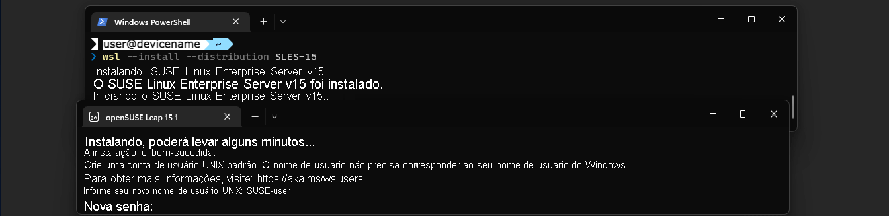

# Instalar e configurar o Linux no Windows com o WSL
O WSL (Subsistema do Windows para Linux) deve ser habilitado e uma distribuição do Linux deve ser instalada antes que você possa executar comandos do Linux e acessar ferramentas como o Bash. Esta unidade abordará como você pode habilitar o WSL, instalar distribuições do Linux e configurar um nome de usuário e senha do Linux.
> ❕**Importante**
>  Você deve verificar se está executando o Windows 11 ou o Windows 10 versão 2004+ (Build 19041 e superior) para executar o comando de instalação do WSL.

## Comando de instalação do WSL
Agora você pode instalar tudo o que precisa para executar o WSL inserindo um único comando, `wsl --install`, em um PowerShell do administrador ou Prompt de Comando do Windows e reiniciando sua máquina.

Há algumas coisas a saber sobre o que esse comando realiza e as opções que ele fornece.

Você deve verificar se está executando o Windows 11 ou o Windows 10 versão 2004+ (Build 19041 e superior) para executar o comando de instalação do WSL. [Você pode verificar a versão do Windows em execução no momento e atualizar para uma nova versão](ms-settings:windowsupdate), se necessário. Se você está executando um build mais antigo do Windows e não está conseguindo atualizar, consulte os documentos vinculados no final deste treinamento sobre como habilitar manualmente o WSL e instalar uma distribuição do Linux.

O comando `wsl --install` executa as seguintes ações:

- Habilita o Componente Opcional da Plataforma de Máquina Virtual e instala os binários principais do WSL.
- Baixa o pacote WSL (incluindo o kernel Linux mais recente) da Microsoft Store, permitindo que atualizações e correções de segurança sejam enviadas por push assim que estiverem disponíveis.
- Baixa e instala a distribuição Ubuntu do Linux (a menos que você use uma das opções de comando para escolher uma distribuição diferente).

Para usar o comando install:

Abra o PowerShell ou o Prompt de Comando do Windows no modo de administrador clicando com o botão direito do mouse e selecionando "Executar como administrador".

Insira o comando: `wsl --install`

Você precisará reiniciar o computador após o processo de instalação para começar a usar o WSL.

## Instalar distribuições alternativas do Linux

O comando `wsl --install` instala a distribuição Ubuntu do Linux por padrão. Você pode selecionar uma distribuição diferente do Linux na lista disponível na Microsoft Store. Você também poderá instalar distribuições adicionais do Linux depois de instalar o Ubuntu padrão.

Para conferir quais distribuições estão disponíveis no momento por meio do repositório, insira o comando: `wsl --list --online`

Para selecionar uma alternativa à distribuição padrão do Ubuntu ou instalar distribuições adicionais do repositório, use o comando: `wsl --install --distribution <Distribution Name>`

Se uma distribuição do Linux que você deseja instalar não estiver disponível na Microsoft Store, ainda poderá instalara importando-a usando um arquivo **.tar** ou arquivo **.appx**. Você também pode criar a sua própria distribuição personalizada. Você poderá encontrar um link no final deste treinamento para a documentação sobre como importar ou criar uma distribuição personalizada do Linux. 

Para iniciantes, recomenda-se começar com a distribuição Ubuntu padrão, o que também facilitará o acompanhamento deste tutorial.

> ❕Observação
>
> Para usuários WSL de nível avançado, há algumas opções adicionais que podem ser definidas usando sinalizadores no comando `wsl --install`. Confira a documentação do WSL vinculada no > final deste treinamento para saber mais.
>
> - Se o acesso à Microsoft Store estiver bloqueado, o WSL poderá ser instalado de uma CDN.
> - Há suporte para o comando `wsl --install` no Windows Server com opções para não iniciar automaticamente a distribuição após a instalação ou habilitar componentes WSL sem instalar
> nenhuma distribuição. (Somente no Windows 2019 versão 1709 ou mais recente).
> - Algumas distribuições do Linux poderão ser instaladas com a arquitetura do WSL 1 se você tiver um cenário específico que o exija.
> - Usuários corporativos ou corporativos podem criar uma imagem WSL personalizada para distribuição em sua empresa.

## Configurar seu nome de usuário e senha do Linux
Depois de usar o WSL para instalar uma distribuição Linux e reiniciar o computador, a distribuição será aberta e você será solicitado a "**Digitar um novo nome de usuário UNIX**", junto com uma senha.

Há algumas coisas a serem observadas aqui:

- O nome de usuário e a senha criados aqui serão considerados o administrador do Linux, com a capacidade de executar comandos administrativos sudo (Super User Do).
- Cada conta de usuário é específica de cada distribuição separada do Linux que você instala e não tem relação com seu nome de usuário do Windows. Se você instalar mais de uma distribuição do Linux, cada uma terá suas próprias contas de usuário e senhas separadas do Linux. Você precisará configurar um novo nome de usuário e senha sempre que adicionar uma distribuição, reinstalar ou redefinir.
- O nome de usuário e a senha aceitarão quase tudo como válido, mas alguns caracteres podem causar problemas em vários contextos. O uso de pontuação como sublinhados geralmente é aceito, mas pontos, barras ou dois-pontos, como **/:.**, podem causar problemas, e você definitivamente não deve começar seu nome de usuário com o caractere hífen/menos **-**. Geralmente, recomendamos remover qualquer pontuação incomum. Observe também que, ao inserir a senha, nada aparecerá na tela (isso é normal e chamado de "digitação cega").
- Se você precisar alterar ou redefinir sua senha ou se esquecer a senha de uma distribuição do Linux instalada, confira a documentação do WSL vinculada no final deste módulo.
Depois de inserir um nome de usuário e senha, você poderá confirmar a distribuição do Linux instalada e o número de versão usando o comando: `cat /etc/os-release`.

## Pacotes de atualização e upgrade
Recomendamos que você atualize e faça upgrades com frequência aos pacotes incluídos na distribuição do Linux depois de instalados. Atualizar regularmente garantirá que você tenha as atualizações de segurança mais recentes. O Windows não atualiza nem faz upgrade automaticamente de suas distribuições do Linux. Essa é uma tarefa que a maioria dos usuários do Linux prefere controlar por conta própria. Cada distribuição tem gerenciadores de pacotes associados para lidar com isso. Para Ubuntu ou Debian, o gerenciador de pacotes incluído é chamado de "**apt**" (para Advanced Package Tool).

Para atualizar e fazer o upgrade de pacotes para a distribuição padrão do Ubuntu usando apt:

1. Abra o Ubuntu (você poderá encontrá-lo no menu de pesquisa do Windows depois que ele for instalado).
2. Insira o comando: `sudo apt update && upgrade`
3. Atualizar e fazer o upgrade de pacotes requer permissões elevadas de "sudo" (superuser do). Portanto, você também precisará inserir a senha que criou para a distribuição do Linux.

É melhor executar os dois comandos. O comando *update* atualiza a lista de pacotes disponíveis e suas versões, mas não instala ou atualiza nenhum pacote. O comando *upgrade* instala versões mais recentes dos pacotes que você instalou. Recomenda-se executar a atualização primeiro (ou ao mesmo tempo que no comando combinado acima) para que o gerenciador de pacotes esteja ciente das atualizações disponíveis para o software que você instalou.

[Navegar para: Entendendo o fluxo de trabalho de desenvolvimento do WSL](./understanding-workflow.md)