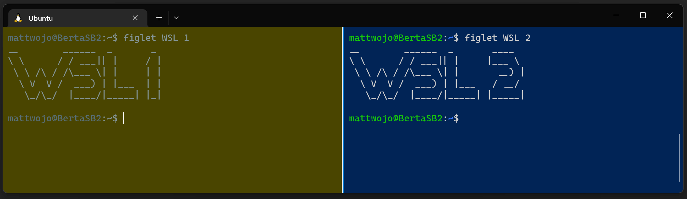

# O que é o WSL?
O WSL permite instalar e executar distribuições do Linux no Windows. Isso pode ser um pouco confuso, pois o Linux, assim como o Windows, também é um SO (sistema operacional)... portanto, você está basicamente executando dois sistemas operacionais, integrados um ao outro.

## Inicialização dupla e máquinas virtuais
No passado, a execução do Windows e do Linux em um computador exigia que você instalasse os dois sistemas operacionais separadamente e usasse um gerenciador de inicialização para escolher qual executaria seu computador durante a inicialização. Há alguns problemas com isso, como a necessidade de reiniciar sua máquina toda vez que você deseja alternar entre os sistemas.

VMs (Máquinas virtuais) são uma maneira de lidar com os problemas da inicialização dupla de dois sistemas operacionais diferentes. As VMs permitem executar uma instância virtualizada do Linux em um dispositivo que executa o Windows. O problema com as VMs geralmente está relacionado ao desempenho mais lento devido à quantidade de recursos que precisam ser alocados para executar a instância virtual, bem como à falta de integração entre os dois sistemas operacionais – você ainda está executando sistemas separados isolados.

O WSL resolve esses problemas integrando o Windows e o Linux a um volume de recursos muito menor, exigindo menos recursos (CPU, memória, armazenamento) em comparação com máquinas virtuais tradicionais. Execute seus aplicativos de escritório favoritos do Windows, ferramentas de desenvolvimento, jogos etc. junto com o seu ambiente de desenvolvimento do Linux com uma velocidade de desempenho incrivelmente rápida e eficiente.

## Como funciona – arquitetura WSL
O WSL foi inicialmente lançado em agosto de 2016 (Windows 10, versão 1607), usando o que agora é chamado de arquitetura "WSL 1". O WSL 1 é executado como uma camada de tradução, usando uma interface de kernel do Linux sobre o kernel do Windows. Você pode pensar no WSL 1 como uma camada de compatibilidade que lida com a emulação de chamada do sistema para executar binários do Linux no ambiente Windows.

Em maio de 2019, o WSL 2 foi anunciado, introduzindo alterações importantes na arquitetura WSL, como o uso de um kernel do Linux real executado por meio de um subconjunto de recursos do Hyper-V. A arquitetura do WSL 2 melhorou significativamente a velocidade de desempenho, permitindo uma reação mais imediata às chamadas do sistema, com menos limitações. O WSL 2 agora é a arquitetura padrão usada ao instalar uma distribuição do Linux.

A arquitetura atual do WSL usa um kernel do Linux personalizado. Esse kernel personalizado do Linux inclui um pequeno script de inicialização no processo de inicialização que forma as conexões entre o Windows e o Linux. O kernel é de código aberto e convida os usuários a relatar bugs ou solicitar recursos.

A arquitetura do WSL permite que qualquer distribuição do Linux seja executada em seu computador Windows e dá suporte à execução de aplicativos GUI (não apenas ferramentas de linha de comando) se você seguir o tutorial na documentação para adicionar os drivers necessários. A arquitetura do WSL também agora dá suporte a "SystemD", um sistema Linux e gerenciador de serviços que estava ausente nas versões anteriores do WSL. As atualizações recentes do tornaram o WSL ainda mais semelhante à execução de distribuições do Linux em um computador bare-metal (sem o sistema operacional Windows).

## Quando usar o WSL?
O WSL é uma ferramenta versátil. Ele fornece uma ótima maneira de aprender a trabalhar com ferramentas do Linux, experimentar diferentes distribuições do Linux ou incorporar ferramentas do Linux e Windows perfeitamente em seu ambiente profissional de fluxo de trabalho e desenvolvimento. O WSL foi projetado para desenvolvimento e tem problemas específicos a serem considerados se você deseja usá-lo para cargas de trabalho de produção, mas é ótimo para pipelines de CI/CD. O WSL também pode ser usado em configurações empresariais de negócios, com a capacidade de criar e distribuir imagens WSL para computadores usados em sua empresa, mas com algumas considerações de segurança específicas a serem consideradas.
[Navegar para: Instalação e configuração do WSL](./install-and-setup.md)

