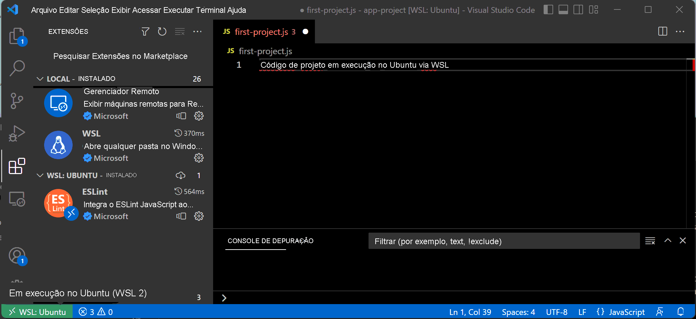
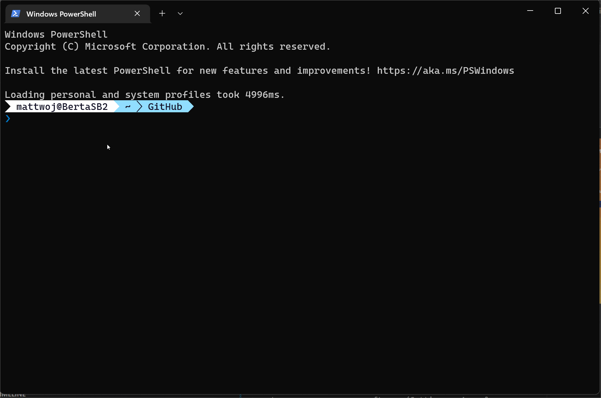
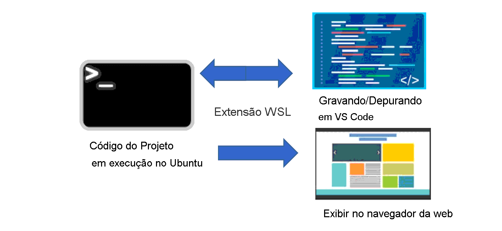
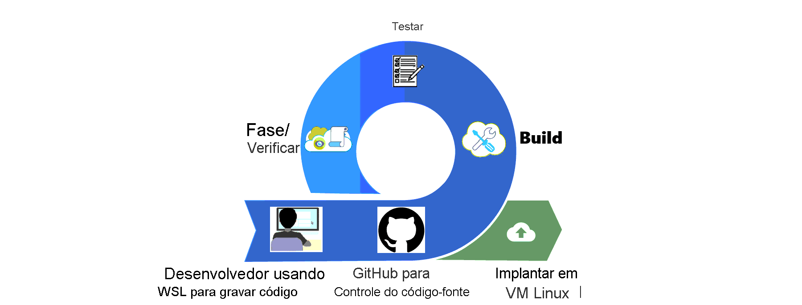

# Entendendo o fluxo de trabalho de desenvolvimento do WSL
A capacidade de usar o Linux e o Windows em um único dispositivo significa que você pode usar suas ferramentas favoritas de qualquer sistema. Nesta seção, recomendaremos algumas das ferramentas, utilitários de linha de comando, linguagens de codificação e estruturas que melhor dão suporte a um ambiente de desenvolvimento tranquilo ao usar o WSL. Você precisará ter em mente que está trabalhando entre dois sistemas de arquivos diferentes. Para obter o melhor desempenho do seu ambiente, há algumas melhores práticas a serem consideradas para o fluxo de trabalho.

## Noções básicas de um fluxo de trabalho de desenvolvimento do WSL
Para começar, vamos examinar algumas das ferramentas de desenvolvimento padrão, utilitários de linha de comando, linguagens/estruturas de código e práticas envolvidas em um fluxo de trabalho de desenvolvimento do WSL.

## Recomendações da ferramenta de desenvolvedor
Sua escolha de ferramentas depende muito do tipo de trabalho de desenvolvimento para o qual você planeja usá-las. Há alguns que recomendamos especificamente para um fluxo de trabalho do WSL, especialmente se você está apenas começando a usar o WSL, incluindo:

- **Editor de Código**: Visual Studio Code com a extensão WSL

O VS Code é um editor de código gratuito e software livre, às vezes também chamado de IDE ou Ambiente de Desenvolvimento Integrado. Ele dá suporte a depuração, realce de sintaxe, conclusão de código inteligente (IntelliSense), comandos Git integrados e um amplo mercado de extensões que permitem a instalação de ferramentas de suporte adicionais.

Um motivo para recomendar o VS Code é a extensão WSL. Essa extensão permite que a interface do usuário do VS Code seja executada no Windows, enquanto seus comandos, extensões, depuração, preenchimento automático de código, linting etc. funcionarão no Linux. Sem essa extensão, você teria problemas de desempenho e compatibilidade ao trabalhar entre os sistemas de arquivos Windows e Linux. Com a extensão, você pode executar seus projetos de código do Linux em um ambiente encapsulado, isolado do Windows. As ferramentas, linguagens, compiladores e extensões que você executa no ambiente Linux não modificarão ou interromperão nada instalado em seu ambiente Windows.

- **Linha de comando e utilitários**: Terminal do Windows com Bash + PowerShell personalizado

O Terminal do Windows agora é o host de linha de comando padrão para Windows 11. Portanto, todas as distribuições do Linux instaladas terão automaticamente um perfil criado no Terminal do Windows. Esse perfil pode ser personalizado com qualquer tipo de tamanho de texto, fontes, cores etc. que você preferir. O Bash é o interpretador de linha de comando que vem com quase todas as distribuições do Linux. Ele pode ser usado com ferramentas utilitárias para coisas como pesquisar arquivos e diretórios, exibir informações de desempenho do sistema, analisar o espaço em disco disponível, monitorar sua interface de rede, bem como para automatizar tarefas por meio de scripts. O PowerShell tem as mesmas finalidades, mas para o Windows. Uma das grandes vantagens do WSL é que você pode misturar comandos e scripts do Bash e do PowerShell. Com o Terminal do Windows, você pode executar várias linhas de comando Bash e PowerShell ao mesmo tempo, lado a lado em guias ou painéis de janela.

- **Linguagens de código e estruturas de aplicativos**: instale o código do projeto no sistema de arquivos Linux usando um gerenciador de pacotes

No Windows, o software é tradicionalmente instalado usando arquivos executáveis (.exe) e usando a GUI de configurações para gerenciar ou remover software (Configurações > Aplicativos & Recursos). No Linux, os "gerenciadores de pacotes" lidam com o processo de instalação, atualização, configuração e remoção de software. Ao trabalhar no Linux com WSL, você precisará usar um gerenciador de pacotes para instalar idiomas de código e estrutura de aplicativo no diretório do sistema de arquivos Linux associado à distribuição que está usando. A distribuição WSL padrão, Ubuntu, usa o gerenciador de pacotes "apt" (abreviação de "Advanced Package Manager"). Você sempre deve instalar as linguagens/estruturas/ferramentas que usará no mesmo sistema de arquivos em que criará o código do projeto. Dicas para trabalhar entre sistemas de arquivos e como obter o melhor desempenho são abordadas mais detalhadamente em outro módulo de treinamento do WSL.

## Cenários comuns para usar um WSL

Algumas situações ou cenários comuns em que um desenvolvedor pode querer usar o WSL incluem:

- Um iniciante que deseja aprender a codificar em ambientes Windows e Linux.
- Um desenvolvedor profissional que deseja acessar as ferramentas do Linux e do Windows.
- Qualquer organização que deseja operacionalizar um fluxo de trabalho de CICD (Integração Contínua e Entrega Contínua), testando atualizações em um computador local antes de implantar atualizações de código na nuvem.
- Qualquer pessoa que queira usar o Docker para criar contêineres, Git para controle de versão, aceleração de GPU para Machine Learning, bancos de dados (como MySQL, PostgreSQL, MongoDB, Redis, SQLite) ou ter acesso a aplicativos de GUI do Linux e Windows ao mesmo tempo.
- Uma empresa que deseja criar imagens WSL personalizadas para distribuição em todos os computadores para que os funcionários tenham acesso seguro ao Windows e ao Linux.

Também há algumas limitações a serem consideradas com o WSL, incluindo:

- O WSL foi projetado para desenvolvimento e inclui alguns recursos que podem dificultar o uso em cenários de produção.
- O WSL usa uma VM de utilitário leve que inicia, para e gerencia recursos automaticamente. Se você estiver tentando usá-lo como um servidor da Web, a VM poderá desligar para limpar os recursos, pois estará detectando que nenhum usuário está ativo. Geralmente, é recomendável usar uma distribuição do Linux mais especificamente projetada para ser um servidor da Web para cenários de implantação.
- O WSL fornece automaticamente acesso a arquivos do Windows e caminhos do Windows. Esse acesso é acrescentado ao seu caminho por padrão, o que pode causar um comportamento inesperado para determinados aplicativos Linux em comparação com um ambiente Linux tradicional.

[Navegar para: Prática de comandos usando WSL](./run-basic-commands.md)